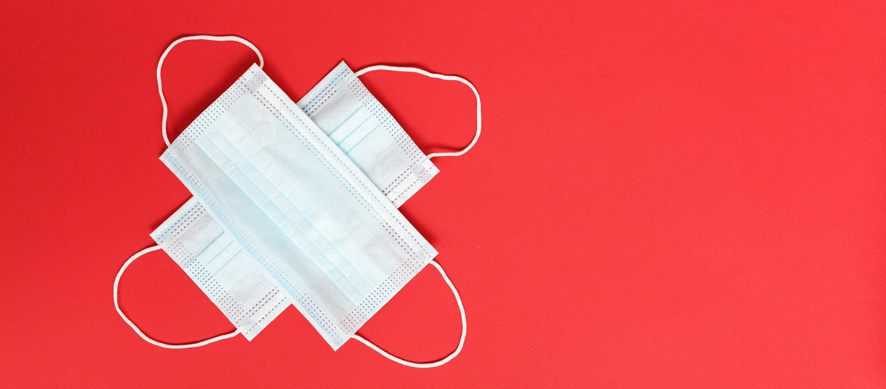
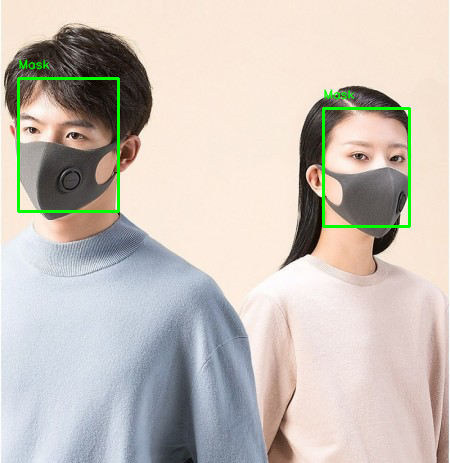

# Mask detection model
  
This project aims to create a simple mask detection model with the usage of openCV and scikit learn.
## The scheme
Before finding masks in the picture, the program finds the faces first by the openCV Cascade Classifier. Then, cropped images are forwarded into the Random Forest Classifier. After being labeled as masked, unmasked or incorrectly masked, pictures are shown with the marked region and text annotation. All of the steps can be seen in the `workflow.ipynb` file.    
  
## The data
As I wanted the model to be able to detect the third class - incorrect mask, I used [this](https://www.kaggle.com/spandanpatnaik09/face-mask-detectormask-not-mask-incorrect-mask) dataset, but the model started overfitting because of the artificially generated masks, so I also added images from [this one](https://www.kaggle.com/ashishjangra27/face-mask-12k-images-dataset). For showing the results on the different image I used the picture available [here](https://www.kaggle.com/andrewmvd/face-mask-detection).
## The application
I deployed the model using Docker container and flask server. It is really easy to use this way! To get it running, all you need to do is:
1. In the directory with the project files run the following command: `docker build . -t mask_detection`. 
2. When the container is buit, you should type `flask run`. 
3. After this, your app is available under this address: `http://127.0.0.1:5000/`. You can simply paste it into your browser.
## The application contents
I enabled model to detect the faces in two modes:
* on the uploaded photo - you should upload an image and in return you will get it with the face region marked and annotated by the prediction: mask, no mask or incorrect.
* on video stream - in this mechanism your computer camera will be accessed and model will strive to classify the detected faces in real time.
## Concerns
As the whole mask detection relies on the prior face detection, the results may be inaccurate when most of the face is obscurred (not only mask, but also glasses or huge hat on the head). Moreover, I noticed the model may also fail when the person's face is mostly facing to the side or is blurred. All of this is the result of the pretrained model I used.
